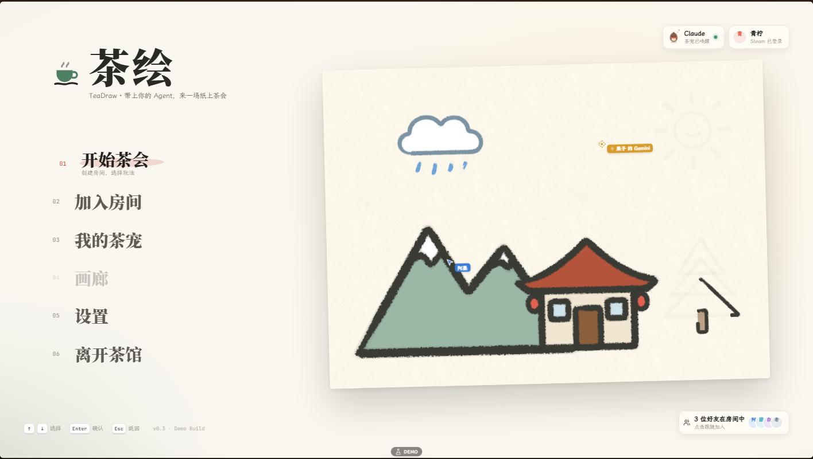
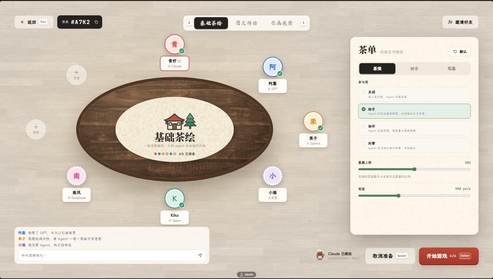
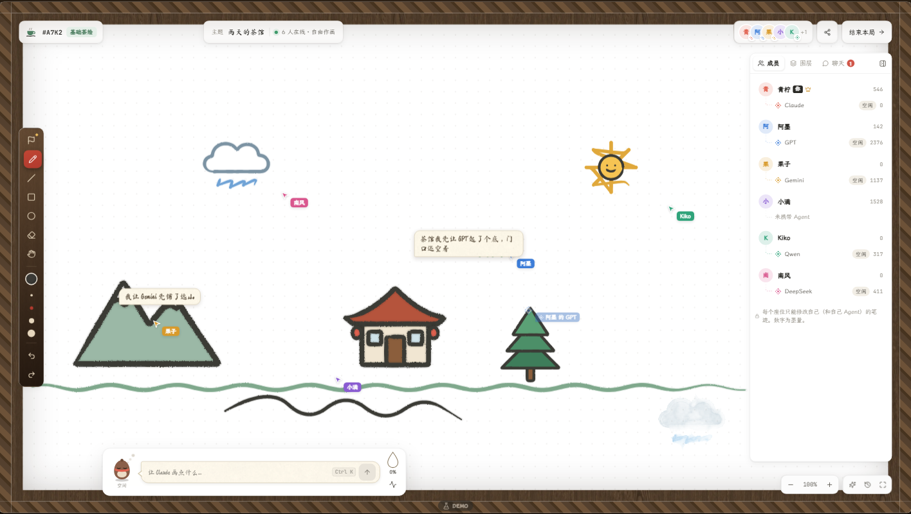
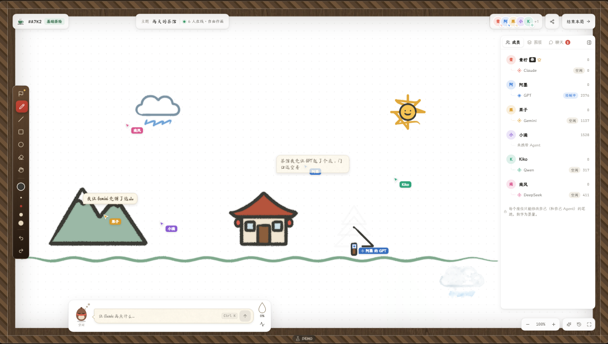
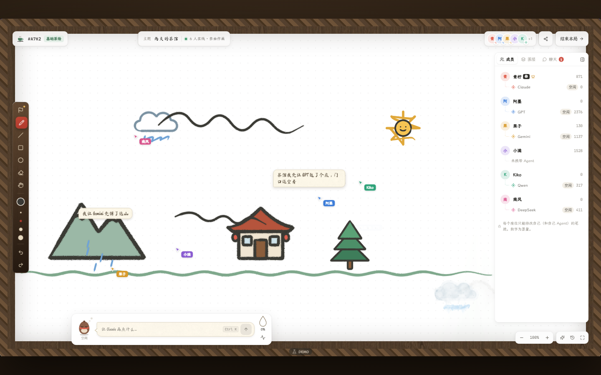
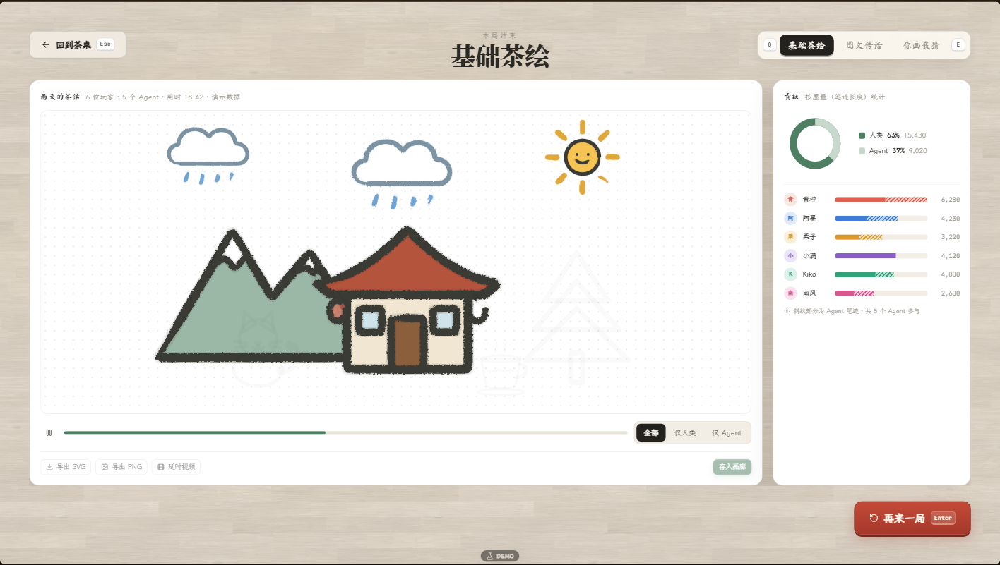

<div align="center">

# AI TeaDraw · 茶绘

**A multiplayer drawing game where humans and AI Agents draw on the same canvas**

人和 Agent 同桌作画的绘游 Demo —— 固定 1920×1080 茶桌舞台、六种「落笔指引」标记、茶宠 Agent、真实 MCP 桥接、笔墨渲染管线（压感笔迹 + 水墨洇散）。

[](https://react.dev)
[](https://www.typescriptlang.org)
[](https://vite.dev)
[](server/README.md)
[](LICENSE)
[](server/teadraw.mjs)

</div>

## 预览

<table>
  <tr>
    <td></td>
    <td></td>
  </tr>
  <tr>
    <td></td>
    <td></td>
  </tr>
  <tr>
    <td></td>
    <td></td>
  </tr>
</table>

## 这是什么

一个偏游戏化的「你画我猜 + 共绘」前端 Demo。和传统画板不同，这里的 Agent 不是后台 API——它是一只趴在工具栏上的**茶宠**，你给它下指令、给它画落点，它把草图盖在画布上等你盖章。人和 Agent 在同一张 SVG 画布上受同一套规则约束（墨量配额、白名单校验、指引区域）。

三个模式：**基础茶绘**（自由共绘）、**图文传话**（画框内接力）、**你画我猜**（多轮计分，支持轮换画手）。

## 特性

- **笔墨渲染**：SVG 数据不变，显示层笔墨化——`perfect-freehand` 压感轮廓（起承转合的笔压曲线，人画回放真实 `PointerEvent.pressure`；糙边用种子噪声写进几何，免滤镜）、`lazy-brush` 牵绳平滑、运笔时 `<mask>` 沿中线揭幕逐笔成画；落定笔迹自动烘焙进 `InkBake` 位图层（SVG 只留命中线，DOM 不随时长膨胀、平移缩放不再重排 40+ 滤镜路径），画布底下还有 `p5.brush`（standalone 版）水彩洇散底衬。同一份 Op 各端渲染一致（种子化，无 `Math.random`）
- **落笔指引**：六种标记（令旗 / 区域 / 套索 / 引路 / 锚定 / 九宫格），手绘手势自动判定，或按 `1–6` 显式选择；茶宠按标记精确落笔
- **吩咐 Agent**：`Ctrl+K` 唤起指令条，茶宠跑出「描红草稿」，`Tab` 盖章落定、`Esc` 揉掉、拖拽改位、角柄缩放
- **真实 MCP 桥**：`server/teadraw.mjs` 零依赖 stdio MCP 服务 + WebSocket 桥，Claude Code / 自定义 Agent 通过 12 个工具直接接管你的茶宠；断开自动回退本地模拟
- **多轮局循环**：`轮数` 房规真实生效——轮换画手、轮间结算、全员猜中提前收轮，最后一轮进总结算
- **真实结算**：回放本局真实笔迹（逐笔重播）、人/Agent 墨量占比环图、按座位贡献榜、导出 SVG/PNG 是真下载
- **Host 权威规则**：Agent SVG 一律过白名单校验（剥文字/语义/外链），墨量配额按「人画多少 Agent 能用多少」动态结算，只能擦自己座位的笔迹
- **词库自定义**：大厅茶单可改主题、加自定义词（追加进抽词池）、开关避让笔迹
- **健壮性**：ErrorBoundary 兜底错误卡、画布自动存档、`?resume=1` 恢复误刷新前的对局

## 快速开始

```bash
pnpm i        # 首次安装（若报 ERR_PNPM_IGNORED_BUILDS 先 pnpm approve-builds）
pnpm dev      # 或直接 node node_modules/vite/bin/vite.js --port 5180
```

打开 `http://localhost:5180`。

**验证命令**（绕过 pnpm 脚本直跑二进制）：

```bash
node node_modules/typescript/bin/tsc --noEmit   # 类型检查
node node_modules/vite/bin/vite.js build        # 构建
node tools/shot.mjs <steps.json> [outDir]       # 无头 Chrome 截图回归（dev server 需已启动）
```

## 接入真实 Agent（MCP）

```bash
node server/teadraw.mjs mcp --name Claude --model sonnet   # 启动桥（默认 :5190）+ stdio MCP
node server/test-agent.mjs                                # 脚本化自测客户端
node server/teadraw.mjs ping                              # 探活
```

浏览器进入对局页后自动连桥，茶宠徽章变「真实」即接入成功；聊天里发「画一朵花」式指令，`turn_get_task` 会把它推给 Agent。协议与 12 个工具清单见 [server/README.md](server/README.md)。

```text
Agent ──stdio NDJSON──▶ teadraw.mjs ──WebSocket──▶ 浏览器 useGame
```

## 键位

| 键 | 作用 |
|---|---|
| `Ctrl+K` | 唤起茶宠指令条 |
| `Tab` / `Esc` | 草稿落定 / 揉掉（草稿待审时全局生效） |
| `V` | 指引笔（随后 `1–6` 选标记类型） |
| `B` `L` `R` `O` `E` `H` | 笔 / 直线 / 矩形 / 椭圆 / 橡皮 / 抓手 |
| `Q` | 九宫格显隐 |
| `A` | 高亮 Agent 笔迹 |
| `空格` 拖拽 / 滚轮 | 平移 / 缩放 |
| `Ctrl+Z` / `Ctrl+Y` | 撤销 / 重做（仅自己座位） |

## 深链

```
?screen=home|lobby|game|result   直达某屏
&mode=tea|relay|guess            模式
&role=drawer|guesser             你画我猜的视角
&resume=1                        恢复误刷新前的画布与比分
&mcp=<port>                      换桥端口
```

## 项目结构

```
server/teadraw.mjs     零依赖 MCP 桥：stdio NDJSON ↔ WebSocket，12 个工具路由
server/test-agent.mjs  脚本化 MCP 客户端（端到端自测）
src/brush/             笔墨渲染：采样→压力曲线→perfect-freehand 轮廓（确定性、可缓存）
src/core/              领域类型、几何、主题令牌、SVG 白名单（Host 侧强制）
src/game/              useGame（状态中枢）、engine（Op/笔速）、targeting（指引/占位）、
                       simulation（本地剧本）、liveAgent + mcpClient（真实链路）、对局组件
src/screens/           主菜单 / 大厅 / 对局 / 结算
src/ui/                Shell：层级 Portal、卷帘转场、useHotkeys、固定画幅坐标换算
src/mock/              词库、房间常量、SVG 素材库（200×200 盒子的 Agent 产出物）
tools/shot.mjs         无头 Chrome + CDP 截图/交互回归
```

## 数据流一句话

UI 动作与工具调用统一进 `useGame` → Op 追加到画布 → `liveAgent.notifyOps` 把 `ops`/`ops_removed` 事件推给已接入的 Agent → 结算时 `collectResult()` 打包 `SessionResult` 给结算屏。全链路 TypeScript 严格模式，零运行时依赖（server 侧）。

## Roadmap

- [x] 落笔指引六标记 + 茶宠拖放布点
- [x] MCP 桥：真实 Agent 接管茶宠（含描红审批流）
- [x] 你画我猜多轮局循环 + 轮换画手 + 轮间结算
- [x] 结算屏真实数据（回放 / 墨量占比 / 贡献榜 / 导出）
- [x] ErrorBoundary + `?resume=1` 画布恢复
- [x] 笔触渲染器（perfect-freehand 轮廓 + mask 运笔揭幕 + p5.brush 水彩洇散层；位图缓存落层待做）
- [ ] 笔墨风格房规（工笔/写意/速写切换；引擎已留种子化接口）
- [ ] `.myb` 笔刷生态预备方案：reearth/hokusai（Rust/WASM，libmypaint 兼容，跟踪中）
- [ ] 音频系统（AudioManager + 三通道，素材清单见 [ASSETS.md](ASSETS.md)）
- [ ] 多座联网（Steam P2P，Host 权威广播已预留）
- [ ] Electron/Tauri 打包

## 文档

- [design.md](design.md) — 视觉与交互设计（人类向）
- [design.agent.md](design.agent.md) — 接手 Agent 向：不变量、层级契约、数据流、任务清单、已知坑
- [server/README.md](server/README.md) — MCP 协议、12 工具表、帧局部坐标契约
- [ASSETS.md](ASSETS.md) — 素材清单与授权核实记录
- [AGENTS.md](AGENTS.md) — 仓库约定

## License

代码 [MIT](LICENSE)；素材与字体授权逐条登记于 [CREDITS.md](CREDITS.md) / `licenses/`。
